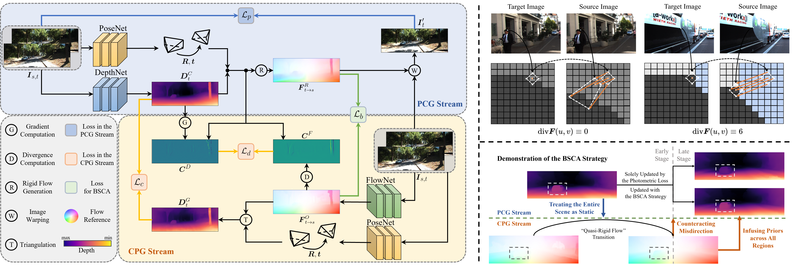

# DCPI-Depth: Explicitly Infusing Dense Correspondence Prior to Unsupervised Monocular Depth Estimation

Official PyTorch implementation for the paper: 

<div id="top" align="center">

> DCPI-Depth: Explicitly Infusing Dense Correspondence Prior to Unsupervised Monocular Depth Estimation  <br>
> [Mengtan Zhang](https://scholar.google.cz/citations?user=uanS4aIAAAAJ&hl=zh-CN&oi=sra), Yi Feng, Qijun Chen, [Rui Fan](https://scholar.google.cz/citations?user=P5AJTXcAAAAJ&hl=zh-CN&oi=sra)<br>
> IEEE Transactions on Image Processing (T-IP), 2025<br>
> [**[Paper]**](http://arxiv.org/abs/2405.16960).

<br>
<br>

</div>

## Table of Contents
- [Install](#install)
- [Dataset](#dataset)
- [Training](#training)
- [Evaluation](#evaluation)
- [Pretrained Models](#pretrained-models)
- [Citation](#citation)

## Install

```
conda create -n dcpi_depth_env python=3.9
conda activate dcpi_depth_env
conda install pytorch torchvision pytorch-cuda=11.7 -c pytorch -c nvidia
pip install -r requirements.txt
```

## Dataset

We organize the video datasets into the following format for training and testing models:<br>
```
Dataset
  -training
    --scene
      ---*.jpg
      ---depth
      ---psedo_depth (if have)
      ---cam.txt
  -testing
    --color
      ---*.jpg
    --depth
      ---*.npy
```

The preprocessed [**[KITTI]**](https://github.com/JiawangBian/sc_depth_pl) and [**[DDAD]**](https://github.com/JiawangBian/sc_depth_pl) datasets are provided by the project [SC-DepthV3](https://github.com/JiawangBian/sc_depth_pl). <br>
For the [**[nuScenes]**](https://www.nuscenes.org/) and [**[Waymo Open]**](https://waymo.com/open/) datasets, you can download the original data from their official websites, preprocess them by following the instructions from the [Dynamo-Depth](https://github.com/YihongSun/Dynamo-Depth) project, and organize them into the above format. <br>
Additionally, for convenience, we provide a preprocessed [nuScenes testing set]() (about 1.7GB) for direct model evaluation. 

## Training

We provide a bash script ("scripts/run_train.sh"), which shows how to train on the nuscenes, waymo, ddad, and kitti datasets.<br>
```bash
bash scripts/run_train.sh
```
The training setup in this script can be run on a single GPU (≥24GB)

## Evaluation
We provide a bash script ("scripts/run_test.sh") to evaluate the model on the nuscenes, waymo, ddad, and kitti datasets.<br>
```bash
bash scripts/run_train.sh
```
You can also simply run this bash script to reproduce our results using the following Pretrained Models.<br>

## Pretrained Models
We provide models trained on the nuScenes, DDAD, Waymo Open, and KITTI datasets.<br>

[//]: # ([**[Models]**]&#40;&#41;)

|         Model         | Dataset  | Abs Rel | Sq Rel |  RMSE  | RMSE log | delta < 1.25 | delta < 1.25<sup>2</sup> | delta < 1.25<sup>3</sup> |
|:---------------------:|:--------:|:-------:|:------:|:------:|:--------:|:------------:|:------------------------:|:------------------------:|
| [DCPI-Depth (N)](https://1drv.ms/f/c/442eec1e53c2e4bf/EswKSUcn7JZHvkEMbEvoa4MBOEWzMmWsQfTu4hxsY0MbeQ?e=dyyhpc)(*) | nuScenes |  0.157  | 1.795  | 7.192  |  0.255   |    0.790     |          0.914           |          0.959           |
| [DCPI-Depth (D)](https://1drv.ms/f/c/442eec1e53c2e4bf/EgO1O9_PPrZPv44CukbzfMMB6Footc1jTOc9ImjLQWQZig?e=naACkN)(*) |   DDAD   |  0.141  | 2.711  | 14.757 |  0.236   |    0.813     |          0.931           |          0.971           |
| [DCPI-Depth (W)]()(x) |  Waymo   |  0.116  | 0.963  | 5.642  |  0.162   |    0.872     |          0.972           |          0.991           |
| [DCPI-Depth (K)](https://1drv.ms/f/c/442eec1e53c2e4bf/EmMAUiI6Sx1CpmL6gibWX7IBjp8dalW-quhPDFWsgZeqyQ?e=WLOqMA)(*) |  KITTI   |  0.097  | 0.666  | 4.388  |  0.173   |    0.898     |          0.966           |          0.985           |

(*) Recently replicated checkpoints, with minor differences compared to the results in the paper. <br>
(x) Please note that Waymo open dataset is under strict non-commercial license so we are not allowed to share the model with you if it will used for any profit-oriented activities. <br>

You can download the pretrained models and place them under tmp/dcpi-<nuscenes/ddad/waymo/kitti>.
Then, run the bash script ("scripts/run_test.sh") to reproduce the above results.

## Acknowledgements

Many thanks to the following excellent open-source projects:
[Lite-Mono](https://github.com/noahzn/Lite-Mono),
[SC-DepthV3](https://github.com/JiawangBian/sc_depth_pl),
[RAFT](https://github.com/princeton-vl/RAFT),
[Dynamo-Depth](https://github.com/YihongSun/Dynamo-Depth),
[MonoDiffusion](https://github.com/ShuweiShao/MonoDiffusion),
[BDE-Depth](https://github.com/LiuJF1226/BDEdepth).

## Citation
If you find our work useful in your research, please consider citing our paper (currently available as a preprint):
```
@article{zhang2024dcpi,
  title={{DCPI-Depth}: Explicitly infusing dense correspondence prior to unsupervised monocular depth estimation},
  author={Zhang, Mengtan and Feng, Yi and Chen, Qijun and Fan, Rui},
  journal={IEEE Transactions on Image Processing},
  year={2025},
  publisher={IEEE}
}
```
